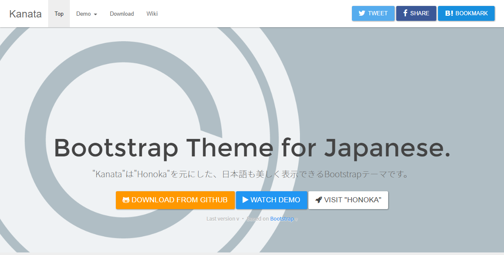

# Kanata

[](https://travis-ci.org/logue/Kanata)
[
[](https://david-dm.org/logue/Kanata#info=devDependencies)
[](LICENSE)

[https://logue.github.io/Kanata/](https://logue.github.io/Kanata/)

[](https://logue.github.io/Kanata/)

"Kanata" は日本語も美しく表示できるBootstrapテーマです。

## About "Kanata"

通常の[Bootstrap](https://getbootstrap.com/)では，日本語のフォント指定や文字サイズは最適とはいえません。"Kanata"はそんなBootstrapをベースに，日本語表示に適したフォント指定や，文字サイズに関するコードを追記したBootstrapテーマの一つです。

## Live Demo

 * [https://logue.github.io/Kanata/bootstrap-ja.html](https://logue.github.io/Kanata/bootstrap-ja.html) (日本語レイアウト)
 * [https://logue.github.io/Kanata/bootstrap.html](https://logue.github.io/Kanata/bootstrap.html) (英語レイアウト)

## Getting Started

### Download

[Releases](https://github.com/logue/Kanata/releases)から最新版をダウンロードしてください。

### Bower

[Bower](https://bower.io/)からインストールすることができます。

最新版をインストールするには以下のコマンドを実行してください。

```
bower install --save-dev $(node -e "$(curl -fsSL https://cdn.honokak.osaka/last.js)" logue Kanata)
```

もしcURLが入っていない環境の場合には、

```
bower install --save-dev Kanata#(version)
```

``(version)``にはバージョン番号を指定します(ex. ``Kanata#3.3.6-b``)。Kanataの最新バージョン番号は[Releases](https://github.com/logue/Kanata/releases)から確認してください。

## Usage

Kanataは単なるBootstrapテーマにしか過ぎないため，基本的な使い方は本家Bootstrapとほとんど変わりません。よって以下に書くことは[本家Bootstrap](https://getbootstrap.com/getting-started/)からの引用，もしくはその一部を変更したものです。用意されたCSSクラスやコンポーネントなど，より詳細な使い方のドキュメントは本家Bootstrapの各種リファレンスページをご覧になることを推奨します。

 * [CSS](https://getbootstrap.com/css/)
 * [Components](https://getbootstrap.com/components/)
 * [JavaScript](https://getbootstrap.com/javascript/)

### Package

配布しているzipファイルの内容物は以下のとおりです。``bootstrap.min.*``といったように，ファイル名に``min``がつくファイルは，改行やインデント・スペーシングをなくした(minifyされた)コードで，ユーザがウェブページを読み込む際の転送量を少なくすることができます。通常はこの``bootstrap.min.*``を使うことをおすすめします。

```
honoka/
├─ bootstrap.html
├─ css/
│   ├─ bootstrap.css
│   └─ bootstrap.min.css
├─ fonts/
│   ├─ glyphicons-halflings-regular.eot
│   ├─ glyphicons-halflings-regular.svg
│   ├─ glyphicons-halflings-regular.ttf
│   ├─ glyphicons-halflings-regular.woff
│   └─ glyphicons-halflings-regular.woff2
└─ js/
     ├─ bootstrap.js
     └─ bootstrap.min.js
```

### Basic Template

Bootstrapをつかってウェブページを作成する際に基本となるHTML部分は以下のようになります。CSSやJavaScriptのファイルパスは環境に合わせて変更する必要があります。

```html
<!DOCTYPE html>
<html lang="ja">
  <head>
    <meta charset="utf-8" />
    <meta http-equiv="X-UA-Compatible" content="IE=edge" />
    <meta name="viewport" content="width=device-width, initial-scale=1" />
    <!-- The above 3 meta tags *must* come first in the head; any other head content must come *after* these tags -->
    <title>Bootstrap Template</title>

    <!-- Bootstrap -->
    <link href="css/bootstrap.min.css" rel="stylesheet" />

    <!-- HTML5 shim and Respond.js for IE8 support of HTML5 elements and media queries -->
    <!-- WARNING: Respond.js doesn't work if you view the page via file:// -->
    <!--[if lt IE 9]>
      <script src="https://cdn.jsdelivr.net/html5shiv/3.7.3/html5shiv.min.js" integrity="sha384-qFIkRsVO/J5orlMvxK1sgAt2FXT67og+NyFTITYzvbIP1IJavVEKZM7YWczXkwpB" crossorigin="anonymous"></script>
      <script src="https://cdn.jsdelivr.net/respond/1.4.2/respond.min.js" integrity="sha384-ZoaMbDF+4LeFxg6WdScQ9nnR1QC2MIRxA1O9KWEXQwns1G8UNyIEZIQidzb0T1fo" crossorigin="anonymous"></script>
    <![endif]-->
  </head>
  <body>
    <h1>Hello, world!</h1>

    <!-- jQuery (necessary for Bootstrap's JavaScript plugins) -->
    <script src="https://cdn.jsdelivr.net/jquery/2.2.4/jquery.min.js" integrity="sha384-rY/jv8mMhqDabXSo+UCggqKtdmBfd3qC2/KvyTDNQ6PcUJXaxK1tMepoQda4g5vB" crossorigin="anonymous"></script>
    <!-- Include all compiled plugins (below), or include individual files as needed -->
    <script src="js/bootstrap.min.js"></script>
  </body>
</html>
```

### Do you hate "Noto Sans JP"?

もしあなたが日本語フォントにNoto Sans JPを指定したくない場合，その要素に対して``.no-thank-yu``(※``you``ではなく``yu``)を指定することでNoto Sans JPの指定はされなくなり，Windowsであればメイリオ，Mac OS Xであればヒラギノ角ゴを優先的に使用するようになります。

例えばページ全体に対してNoto Sans JPを用いたくない場合は，``<body>``に対して``.no-thank-yu``を指定(``<body class="no-thank-yu">``)することで，ページ全体でNoto Sans JPは使用されなくなります。

## Build

ビルドの方法については [Wiki](https://github.com/windyakin/Honoka/wiki) をご覧ください。

## License

[MIT License](LICENSE)

## Author

 * windyakin ([windyakin.net](http://windyakin.net/))
 * Logue([Epilogue/LogueWiki](https://logue.be/))